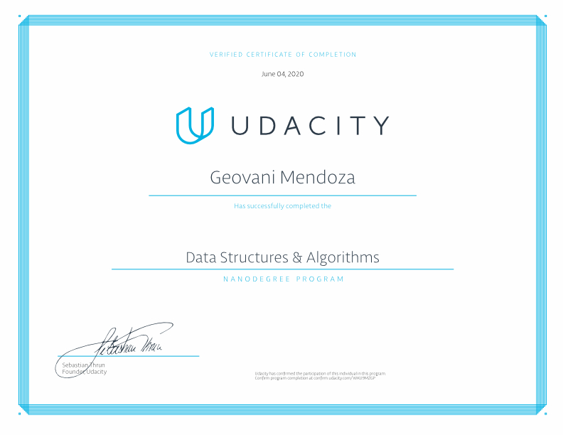

# Data Structures & Algorithms

In this course I learned data structures and algorithms by solving 100+ practice problems :rocket: :rocket: :rocket:. The course starts from learning python programming to learning data structures to learning basic algorithms and finally learning advanced algorithms like A*.

## Table of Contents

[1. Data Structures](#data-structures)

[2. Basic Algorithms](#basic-algorithms)

[3. Advanced Algorithms](#advanced-algorithms)


<a name="data-structures"/>

### Data Structures


<a name="basic-algorithms"/>

### Basic Algorithms

<a name="advanced-algorithms"/>

### Advanced Algorithms


## Installation

### Anaconda :fire:

The Anaconda distribution is free to install and can be downloaded using:

[https://www.anaconda.com/download/](https://www.anaconda.com/download/)

Based on your operating system, installation instructions are available online:

- [Installing on macOS](https://docs.anaconda.com/anaconda/install/mac-os/)
- [Installing on Linux](https://docs.anaconda.com/anaconda/install/linux/)
- [Installing on Windows](https://docs.anaconda.com/anaconda/install/windows/)

### Python 3 :snake:

Python 3 is required to run the files within this repository.

## Run
In a terminal or command window, navigate to the top-level project directory `Data-Structures-and-Algorithms/` (that contains this README) and run the following command:

```bash
jupyter notebook jupyter_notebook.ipynb
```

or
```bash
jupyter notebook jupyter_notebook.ipynb
```

on any Jupyter Notebook.
This will open the iPython Notebook software and project file in your browser.

## I Finally Graduated! :blush:



Verify [here](https://graduation.udacity.com/confirm/WKU9MZGP).
## Additional Resources

[Big-O Cheatsheet](https://www.bigocheatsheet.com/)

[Python Complexities](https://wiki.python.org/moin/TimeComplexity)

[Understanding the Slice notation](https://stackoverflow.com/questions/509211/understanding-slice-notation)

[Reversing a Linked List: Easy as 1, 2 ,3](https://medium.com/outco/reversing-a-linked-list-easy-as-1-2-3-560fbffe2088)

[What do these operators mean (** , ^ , %, //)?](https://stackoverflow.com/questions/15193927/what-do-these-operators-mean/15193961)

[Python - public, private and protected Access Modifiers](https://www.tutorialsteacher.com/python/private-and-protected-access-modifiers-in-python)

## License

This project uses the [MIT](https://choosealicense.com/licenses/mit/) License.